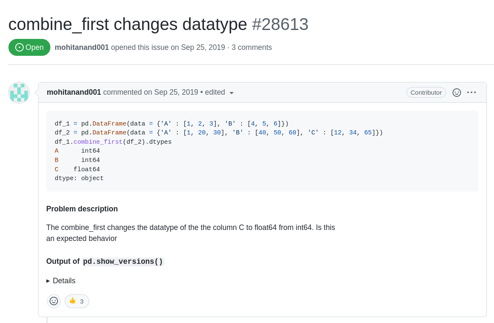
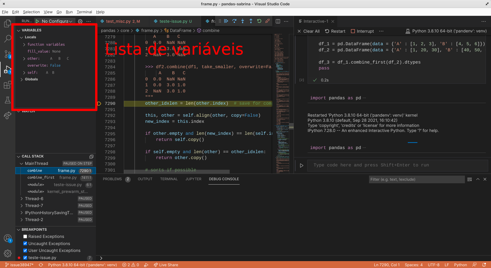

<!-- footer: Apresentado na Python Brasil 2021 -- igordsm@gmail.com -->

# Experiências mentorando contribuições a software livre (na faculdade)

#### Igor dos Santos Montagner ( [igordsm@gmail.com](mailto:igordsm@gmail.com) )

----------

# Apresentação

#### Graduação + Doutorado na USP

#### Professor no Insper
- Engenharia e Ciência da Computação
- Sistemas de Computação

#### Entusiasta de Software Livre há 15 anos

---

# Como aprender **Desenvolvimento de Sistemas**?

Na faculdade em geral 

- criamos um projeto novo
- que tem por objetivo testar o conhecimento em algo específico da disciplina
- normalmente morre após a disciplina
- e nunca é usado por ninguém
-----

# Como aprender **Desenvolvimento de Sistemas**?

Na vida profissional também precisamos trabalhar em projetos já existentes

- que são usados por vários usuários
- corrigindo problemas
- realizando melhorias

------

# Experiências de aprendizagem não combinam com o trabalho que vai ser feito no futuro

### e os alunos não necessariamente compreendem isso

----

# Desenvolvimento Aberto

Ao final da disciplina o estudante será capaz de:

- Baixar, entender e **modificar** o código de um projeto
- Conseguir que suas modificações sejam **aceitas pelo projeto original**

## Contribuir com software de código aberto

[Mais informações](https://insper.github.io/dev-aberto)

---

# Habilidades envolvidas ao contribuir

1. uso de Controle de Versão para trabalho em equipe
2. capacidade de debug e leitura de código
3. familiaridade com CI, testes, linting, etc
4. registro público de como você colabora

### Estes temas fazem mais sentido em equipes ao longo do tempo

---

# Escolha de projetos é completamente livre

----

# Escrever software que as pessoas usem, em conjunto com outras pessoas

---

# Motivações dos alunos

- Aprender uma linguagem/tecnologia específica
- Aprender fluxo de contribuição usado em trabalho remoto
- Modificar código que eu não conheço
- Conseguir um PR aceito em um projeto grande
- Contribuir para o projeto X

--- 

# Resultados nos últimos anos

----

# O que aprendemos com isso?

----

# 1. "Desenvolvimento profissional"

----

----

# "Desenvolvimento profissional"

Software que tem:

1. documentação de usuário e desenvolvedor
2. canais oficiais de comunicação síncrona e assíncrona
3. testes automatizados rodando a cada `push`
5. políticas de qualidade de código e formatação
6. revisão de código

### Tudo isso existe por que é útil, não por que vale nota

----

# 2. Software é desenvolvido no tempo

----

----

----

# Resumo (ao longo de 2 anos)

1. algo está quebrado e temos um exemplo de código que mostra isso
2. em algum momento isso "desquebrou". Não sabemos quando
3. escrevemos um teste para garantir que não vai quebrar de novo

--- 

# 3. Encontrar novas referências

----

# Encontrar novas referências

- Eu (professor) não deveria ser uma referência de "bom desenvolvedor"
- Tem muita gente boa por aí; aprender com essas pessoas é importante

## PR recebe feedback de pessoas "de fora" da universidade

----

# Quais as principais dificuldades?

-----

# 1. Por onde começar?

### Escolhendo um projeto e uma issue legal

-----

# Comunidade importa

### Não por que está no Github que é um **projeto** de código aberto

----

# Comunidades receptivas

### Documentação de desenvolvimento

### Indicações de onde novatos podem iniciar

### Contribuições aceitas recentemente

### Comunicação com a equipe

----

## *Good first issue*

----

## *Docs*

----

# Agregadores interessantes

- [goodfirstissue.dev](https://goodfirstissue.dev/)
- [awesome-for-beginners](https://github.com/MunGell/awesome-for-beginners)

### Procure por softwares que você usa

----

# 2. Debugging "de verdade"

----

# `print("chegou aqui")`

----

# `print("chegou aqui")`

....

# `print("chegou aqui 2")`

----

# `print("chegou aqui")`

....

# `print("chegou aqui 2")`

...

# `print("chegou aqui 3")`

----

# `print` não é uma ferramenta de debug adequada

## Aprender a debugar seu IDE/editor preferido é essencial

----

----

----

----

----

----

# Com todas essas ferramentas à mão, ainda faz sentido `print`?

----

# 3. Fluxo de trabalho distribuído

----

# Fluxo de trabalho distribuído 

Trabalhar em um projeto em que

- interação **assíncrona** feita principalmente via meios digitais
- existe algum fluxo de revisões e código entra no `main` só se for aprovado
- cada pessoa trabalha em **horários** e quantidades de tempo **diferentes**
- **sem conhecer pessoalmente** a maioria das outras pessoas com quem interaje

### Colaboração usando controle de versão

---

https://www.slideshare.net/abderrahmanebenbachir/continuous-integration-in-github 

---

https://www.slideshare.net/abderrahmanebenbachir/continuous-integration-in-github 

----

# 4. Mandei meu PR, e agora?

----

## É só esperar ser aceito?

----

# Contribuir não é doar código para o projeto

## Aceitar seu PR significa suportar ele por tempo indefinido

----

https://github.com/elementary/camera/pull/138

----

# Código só é aceito se tiver qualidade mínima

## Tudo bem não acertar de primeira

----

# Finalizando

Participar em projetos de software livre

- Expõe o seu trabalho para outras pessoas verem
- Desenvolve habilidades técnicas importantes na vida profissional
- Permite conhecer novas tecnologias
- Te conecta com outras pessoas, formando uma comunidade

## E isso você faz independente da faculdade